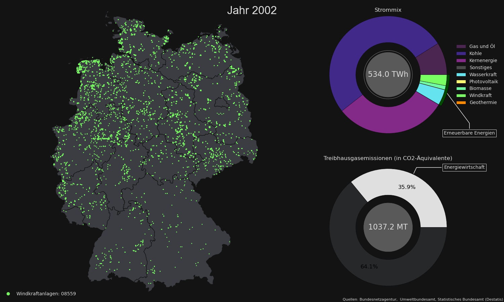
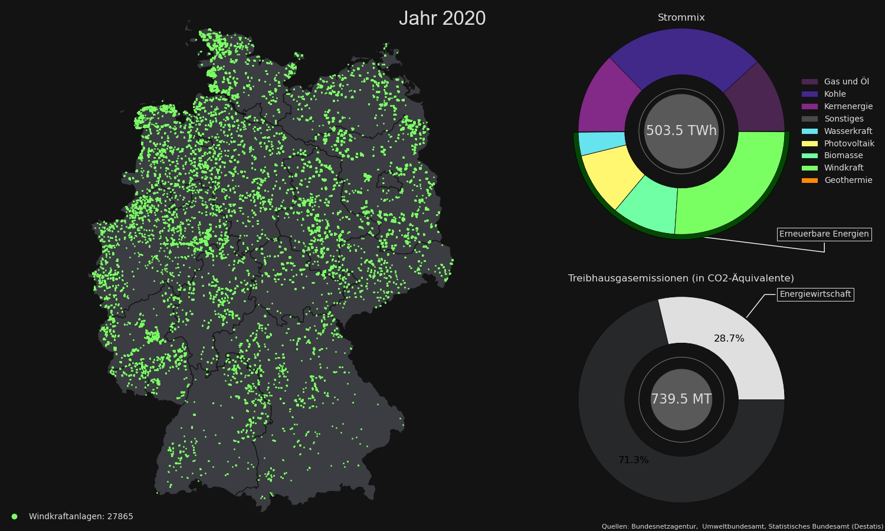

# plot-fun

Some fun with matplotlib and animations. 
This project is more academic to learn a bit about coding and documentation style. 

- A visualization for energy production in germany from 2002 to 2020. Maybe more plots will come later. 

### Usage
Type: python main.py -h

### Examples
        >>> python main.py -i germany_energymix -y 2002 2020
        Hello :)
        I will make images for the years [2002 2020] and no animation.
        I will save the images as germany_energymix_[year].jpeg.

 
     
        >>> python main.py -v germany_energymix -y 2002 2020
        Hello :)
        I will make no images and an animation for 2002-2020.
        I will save the animation as germany_energymix.mp4.
        This might take a while.
        

https://user-images.githubusercontent.com/43760202/129790294-cc45e41d-30b4-4c89-b7ba-345caf73cc70.mp4

     
## License
The code itself is licensed under the [MIT License](LICENSE). 
However, please note that the data is licensed differently. 
For this, see [data explanation and source reference](/data/README.md).
